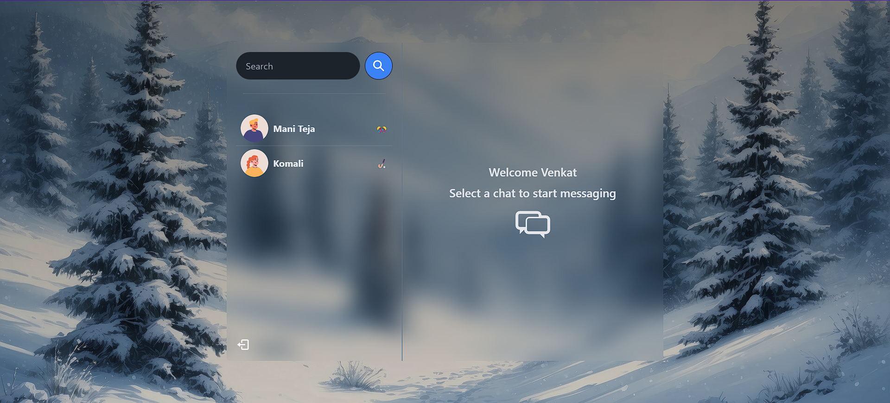

# EasyConnect 

EasyConnect is a messaging app built with MERN stack, Socket.io,TailwindCSS, Daisy UI. It provides features like Authentication & Authorization with JWT, Real-time messaging Online user status, Global state management with Zustand, Error handling.
[🔗 EasyConnect ](https://easy-connect-i6bm.onrender.com)




Some Features:

-   🌟 Tech stack: MERN + Socket.io + TailwindCSS + Daisy UI
-   🎃 Authentication && Authorization with JWT
-   👾 Real-time messaging with Socket.io
-   🚀 Online user status (Socket.io and React Context)
-   👌 Global state management with Zustand
-   🐞 Error handling both on the server and on the client
-   ⏳ And much more!

### Setup .env file

```js
PORT=...
MONGO_DB_URI=...
JWT_SECRET=...
NODE_ENV=...
```

### Build the app

```shell
npm run build
```

### Start the app

```shell
npm start
```
